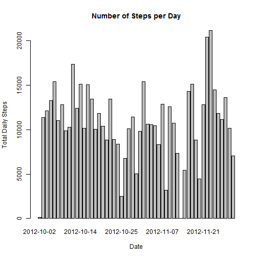

###Introduction

It is now possible to collect a large amount of data about personal movement using activity monitoring devices such as a [Fitbit](http://www.fitbit.com/), [Nike Fuelband](http://www.nike.com/us/en_us/c/nikeplus-fuelband), or [Jawbone Up](https://jawbone.com/up). These type of devices are part of the "quantified self" movement - a group of enthusiasts who take measurements about themselves regularly to improve their health, to find patterns in their behavior, or because they are tech geeks. But these data remain under-utilized both because the raw data are hard to obtain and there is a lack of statistical methods and software for processing and interpreting the data.

This assignment makes use of data from a personal activity monitoring device. This device collects data at 5 minute intervals through out the day. The data consists of two months of data from an anonymous individual collected during the months of October and November, 2012 and include the number of steps taken in 5 minute intervals each day.


###Objective
* Analize the data from Fitbit utilizing the skills learned from this course, as well as those that were learned from the previous courses of the Data Science track.
* Use R markdown so that individuals who might be interested can replicate this work.

  

###Data

The data for this assignment can be downloaded from the course web site:

* Dataset: [Activity monitoring data](https://d396qusza40orc.cloudfront.net/repdata%2Fdata%2Factivity.zip) [52K]

The variables included in this dataset are:

* **steps:** Number of steps taking in a 5-minute interval (missing values are coded as `NA`)

* **date:** The date on which the measurement was taken in YYYY-MM-DD format

* **interval:** Identifier for the 5-minute interval in which measurement was taken

The dataset is stored in a comma-separated-value (CSV) file and there are a total of 17,568 observations in this dataset.


###Loading and preprocessing the data


```r
  if (!file.exists("activity.csv")) {
    unzip("activity.zip")
  }

activity_data <- read.csv("activity.csv")
```

Format the date variable into a date type since it is currently formatted as a string.


```r
  activity_data$date<-as.Date(activity_data$date, format = '%Y-%m-%d')
```


###What is mean total number of steps taken per day?

Aggregate steps taken by date

```r
steps_daily <- aggregate(steps~date, activity_data,sum, na.rm=TRUE)
```


Histogram of the total number of steps taken each day.

```r
  histogram<-barplot(steps_daily$steps, names.arg =steps_daily$date, xlab = "Date",ylab="Total Daily Steps", main="Number of Steps per Day")
```

 

Calculate the mean and median total number of steps taken per day.

```r
mean_steps_daily<- format(mean(steps_daily$steps,na.rm=TRUE),digits = 2, scientific = FALSE)
median_steps_daily<- format(median(steps_daily$steps,na.rm=TRUE), digits = 2, scientific=FALSE)
```

The daily `mean` steps is 10766 and the `median` is 10765.

  

###What is the average daily activity pattern?

Getting the average number of steps taken.

```r
ave_interval <- aggregate(steps ~ interval, activity_data, mean)
```


Below is a time series plot of the 5-minute interval (x-axis) and the average number of steps taken, averaged across all days (y-axis).

```r
plot(ave_interval, type = "l", xlab="Interval", ylab="Average Steps", main="Average steps per interval")
```

 

Getting the maximum number of steps.


```r
max_steps <- ave_interval$interval[which.max(ave_interval$steps)]
```

Interval 835 has the maximum number of steps.


###Imputing missing values

Calculating the total number of rows with missing values in the dataset.

```r
na_rows <- format(sum(!complete.cases(activity_data)), digit = 2,scientific = FALSE)
```

There are 2304 rows with NAs.


* Using the mean to fill the missing value


Filling up the missing values.

```r
activity_data <- merge(activity_data,ave_interval, by = "interval", suffixes = c("", 
    ".y"))
nas <- is.na(activity_data$steps)
activity_data$steps[nas] <- activity_data$steps.y[nas]
activity_data <- activity_data[, c(1:3)]
```


Histogram of the total number of steps taken each day with the imputed data.

```r
total_steps_per_day <- aggregate(steps ~ date,activity_data,sum)
barplot(total_steps_per_day$steps, names.arg = total_steps_per_day$date, xlab = "Date", ylab = "Total number of Steps",main="Total Steps per Day")
```

 

Calculating for the mean and median with the imputed values included.

```r
imputed_mean_steps <- format(mean(total_steps_per_day$steps), digits = 2, scientific = FALSE)
imputed_median_steps <- format(median(total_steps_per_day$steps), digits = 2,scientific = FALSE)
```

The mean of steps taken per day is 10766 while the median is 10766.


###Are there differences in activity patterns between weekdays and weekends?

Creating a new factor variable in the dataset with two levels: `“weekday` and `“weekend”`, indicating whether a given date is a weekday or weekend.

```r
activity_data$dayType <- ifelse(weekdays(activity_data$date) %in%  c("Saturday", "Sunday"),'weekend','weekday')

head(activity_data)
```

```
##   interval    steps       date dayType
## 1        0 1.716981 2012-10-01 weekday
## 2        0 0.000000 2012-11-23 weekday
## 3        0 0.000000 2012-10-28 weekend
## 4        0 0.000000 2012-11-06 weekday
## 5        0 0.000000 2012-11-24 weekend
## 6        0 0.000000 2012-11-15 weekday
```

Below is panel plot that shows the difference in weekday and weekend patterns.


```r
library(ggplot2)
qplot(x=interval, y=steps,data=subset(activity_data, complete.cases(activity_data)),geom='smooth', stat='summary', fun.y=mean) + facet_grid(dayType~.) + facet_wrap(~dayType,nrow=2) + theme(strip.background = element_rect(fill="#22e5cc")) + labs(title=' Average steps per day: weekdays vs weekend patterns')
```

 
